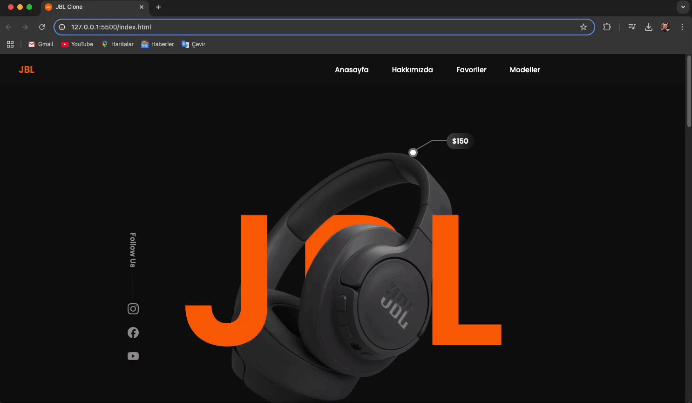

<h1>🚀 JBL Clone Web Site Arayüzü</h1>

"JBL Clone" projesi, JBL markasının enerjik ve yenilikçi ruhunu öne çıkaran, modern bir web tasarım çalışmasıdır. Minimalist bir tasarım yaklaşımı benimseyen proje, kullanıcı deneyimini ön planda tutarak akıcı bir gezinme süreci sunmayı hedefler. JBL’nin ikonik tarzını modern dokunuşlarla harmanlayan bu tasarım, hem görsel açıdan çarpıcı hem de işlevsel bir yapı oluşturur. Her bir detay, markanın dinamik kimliğini yansıtmak için özenle planlanmış ve kullanıcıların estetik beklentilerini karşılamaya yönelik tasarlanmıştır.

<h2>🛠️ Kullanılan Teknolojiler</h2>

-Html
-Css
-Scss

<h2>⚙️ Özellikler</h2>

<h6>Responsive Tasarım:</h6>

Duyarlı Tasarım (Responsive Design): Mobil, tablet ve masaüstü cihazlarda tutarlı ve erişilebilir bir görünüm sağlar.

<h6>Kullanıcı Odaklı Stil:</h6>

Minimalist ve Düzenli Arayüz: Kullanıcıların ürün arama ve inceleme işlemlerini kolaylaştırır.
Kategori ve Menü Düzeni: E-ticaret sitelerinin ihtiyaç duyduğu sezgisel navigasyonu ön planda tutar.
Temiz Renk Paleti: sade ve profesyonel tarzını yansıtan renkler seçilmiştir.

<h1>🎬 Ekran Görüntüsü</h1>

